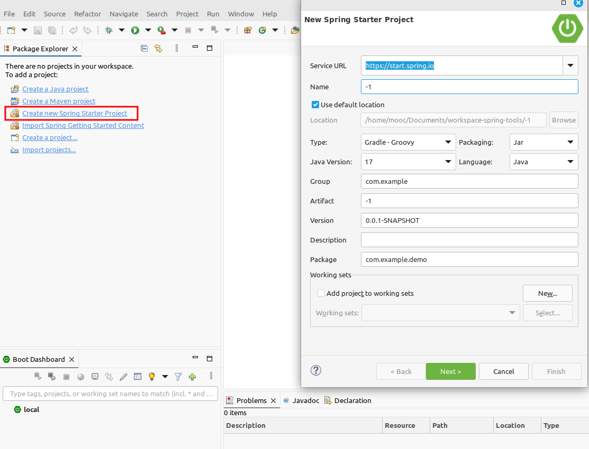
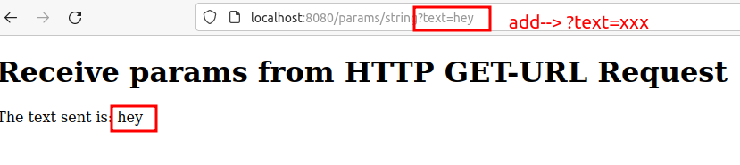

# Documentation

#### First steps

- installing by -tar: go to windows -> preferences -> XML -> Download external resources
- Right click project → Maven → Update Project (Alt + F5) 
- Search in marketplace and Install -> Eclipse Web Developer tools 

#### Errors
- Not loading main class --> delete ~/.m2
- ZipException: invalid LOC header (bad signature) --> delete ~/.m2
- ClassNotFoundException --> delete ~/.m2

- Tomcat connector configured to listen on port 8080 failed to start --> restart app 
- Port may already be in use --> restart app

- Error when packages are different --> all start from the main package 

#### thymeleaf
@{} --> to add links in html file.
